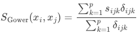

# Trail Recommender

This is our final project for CS5800 - Algorithms at Northeastern University. To view a video of our presentation, [click here](https://youtu.be/xkn75DCSV3o). View our submitted materials in the `submitted materials` folder.

## Data we used
### **Numerical features:**
* _geoloc
* popularity
* elevation_gain
* difficulty_rating
* avg_rating

### **Categorical features:**
* route_type
* features
    * [dogs-no, dogs-leash, ada, beach, cave, strollers, paved, partially-paved, forest, river, waterfall, wild-flowers, lake, historic-site, wildlife, kids, views]
* activities
    * [birding, camping, hiking, nature-trips, trail-running, walking, backpacking, sea-kayaking, canoeing, mountain-biking, horseback-riding, scenic-driving]
    
## How the algorithm works:
### 1) Filters by distance:
The list of trails is first filtered by physical distance. We achieved this by calculating the [geodesic distance](https://geopy.readthedocs.io/en/stable/#module-geopy.distance) between the trail heads and the user's location (employ's the World Geodetic System WGS84 standard for coordinates). The user provides their location and acceptable search radius in miles.

### 2) Calculates the degree of similarity to the user's trail preference:
Program uses the Gower distance function to calculate trail similarity based on user input -- [this video](https://www.youtube.com/watch?v=PHu8VoPv-o4) is a simple explanation of the Gower distance function for mixed data. [View this paper](https://www.researchgate.net/publication/327832223_Distance-based_clustering_of_mixed_data) for a more in-depth explanation of computing similarity for mixed data.

A user may, for example, seek a trail that's around 2 miles long, is good for trail running, and is dog-friendly.

### 3) Sorts the trails by degree of similarity to the user's preference
Once the trail list has been filtered, we use merge sort to sort the list of trails, with the those most relevant to the user appearing first and those least relevant to the user appearing last.
